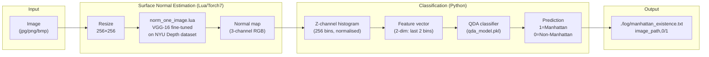
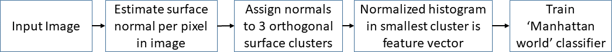
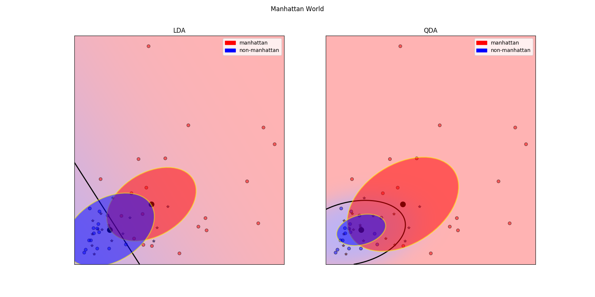

# Verify Manhattan Frame

[](https://www.python.org/)
[](http://torch.ch/)
[](LICENSE)

Detects the **Manhattan Frame Assumption (MFA)** in single images — whether a scene contains three mutually orthogonal surface planes (walls, floor, ceiling) characteristic of man-made indoor environments. Developed for the DARPA **MediFor** (Media Forensics) image integrity analysis program.

---

## Key Idea

A "Manhattan World" has at least one set of three mutually orthogonal surfaces. Detecting this 3D structure from a single 2D image is an open research problem. This system uses a deep CNN trained on the NYU depth dataset to estimate per-pixel surface normals, then classifies the resulting normal distribution:

```
Input image
     ↓
Deep CNN (VGG-16 fine-tuned on NYU)
     ↓
Per-pixel surface normal map (3-channel)
     ↓
Histogram of z-axis (3rd orthogonal plane) normals
     ↓
QDA classifier → Manhattan (1) / Non-Manhattan (0)
```

The key insight: a Manhattan frame produces a characteristic clustering of pixel normals into three orthogonal groups. The smallest cluster (3rd orthogonal plane) histogram is highly discriminative.

---

## Pipeline



---

## Results



*Figure 1: Manhattan World classifier pipeline*



*Figure 2: Linear (LDA) and Quadratic (QDA) Discriminant Analysis on ~100 manually annotated training images. Manhattan-frame images (indoor scenes with orthogonal surfaces) are well separated from flat/outdoor non-Manhattan images.*

---

## Installation

### Python dependencies

```bash
pip install -r requirements.txt
```

### Torch7 (Lua CNN inference)

The surface normal estimator requires [Torch7](http://torch.ch/) with CUDA 8.0 and cuDNN 5.1:

```bash
# Install Torch7
git clone https://github.com/torch/distro.git ~/torch --recursive
cd ~/torch && bash install-deps && ./install.sh

# Install required Lua packages
luarocks install nn
luarocks install cutorch
luarocks install cunn
luarocks install cudnn
luarocks install nngraph
luarocks install optim
luarocks install image
```

> **Modern GPU note:** The pre-trained `.t7` model requires cuDNN 5.1 for CUDA 8.0. The bundled `libcudnn.so.5` is provided for compatibility. For modern GPUs (CUDA 11+) a [PyTorch port of surface normal estimation](https://github.com/princeton-vl/surface_normals) would be needed.

### Pre-trained model

```bash
tar -xvf ./model/sync_physic_nyufinetune.t7.tar.gz -C ./model/
```

This extracts `sync_physic_nyufinetune.t7` — a VGG-16 fine-tuned on the NYU Depth V2 dataset for per-pixel surface normal regression.

---

## Usage

```bash
# Single image
python verifyManhattan.py -t i -f ./image/ship.png

# Text file with list of image paths
python verifyManhattan.py -t l -l ./image/image_list.txt

# Directory of images
python verifyManhattan.py -t d -d ./image/ -r ./log/

# Help
python verifyManhattan.py --help
```

```python
# Use as a library
from verifyManhattan import is_image_manhattan, is_image_folder_manhattan

result = is_image_manhattan('./image/ship.png', output_folder='./log/', verbose=True)
# Returns 1 (Manhattan frame detected) or 0 (Non-Manhattan)
```

### Output format

Results are written to `./log/manhattan_existence.txt`:

```
./image/ship.png,1
./image/pizza.png,0
```

`1` = Manhattan frame detected (3 mutually orthogonal surfaces present)
`0` = Non-Manhattan (predominantly flat / outdoor scene)

---

## Train your own classifier

The `train_classifier.py` script trains LDA and QDA classifiers on manually labelled normal features:

```bash
python train_classifier.py
```

This requires pre-computed normal histograms in `./log/` from running `verifyManhattan.py` on a labelled set. Output: `lda_model.pkl`, `qda_model.pkl`.

---

## Repository Layout

```
VerifyManhattanFrame/
├── verifyManhattan.py        # Main classifier: load QDA, call Lua, predict
├── train_classifier.py       # Train LDA/QDA from labelled normal features
├── download_images.py        # Download images from MediFor API (CSV-based)
├── download_medifor_media.py # Download media/journals/cameras from MediFor API
├── norm_one_image.lua        # Torch7 inference: VGG-16 → surface normal map
├── norm_one_image_nocuda.lua # CPU-only variant (no CUDA)
├── model_deep.lua            # VGG-16 network architecture definition
├── BatchIterator.lua         # Batch iterator for Lua training
├── utils.lua                 # Lua utility functions
├── model/
│   └── sync_physic_nyufinetune.t7.tar.gz   # Pre-trained Torch7 model
├── image/
│   ├── pizza.png             # Sample non-Manhattan image
│   ├── ship.png              # Sample Manhattan image
│   └── image_list.txt        # Sample image list
├── log/                      # Results output
├── util/
│   ├── visualize_result.py   # Plot Manhattan vs Non-Manhattan results
│   └── parsecsv.py           # CSV label parser
├── qda_model.pkl             # Pre-trained QDA classifier
├── lda_model.pkl             # Pre-trained LDA classifier
├── trained_classifier.png    # Classifier decision boundary plot
└── requirements.txt
```

---

## Datasets

| Dataset | Content | Link |
|---------|---------|------|
| NYU Depth V2 | 1,449 RGBD indoor images with surface normals | [NYU Depth](https://cs.nyu.edu/~silberman/datasets/nyu_depth_v2.html) |
| MediFor | Media forensics image corpus | DARPA-controlled |
| Manual training set | ~100 labelled Manhattan/Non-Manhattan images (scraped) | Included in `log/` |

---

## References

- Silberman, N. et al. (2012). *Indoor Segmentation and Support Inference from RGBD Images.* ECCV.
- Wang, X. et al. (2015). *Designing Deep Networks for Surface Normal Estimation.* CVPR.
- Gupta, A. (2017). *Manhattan Frame Detection for Image Forensics.* MediFor Program.

---

## License

GNU GPL v3 — see [LICENSE](LICENSE).
